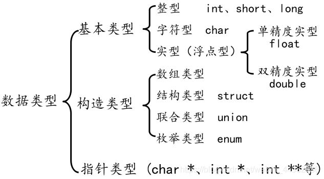
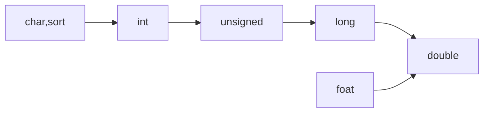

# C语言笔记
当年考研的时候自己写的复习笔记，记录我自己的一些易错点和遗忘点。

## ❤️数据类型

### 一、数据类型分类



### 5. ****构造类型****

| 数组类型 | int [ ], char [ ]等 |
| --- | --- |
| 结构体类型 | struct |
| 枚举类型 | enum |
| 联合类型 | union |

### 6. 指针类型

| 整形指针 | int* |
| --- | --- |
| 字符指针 | char* |
| 单精度浮点型指针 | float* |
| 空类型指针 | void* |

### 1、有符号整型

- int类型
数据类型大小是 4 字节，能表示的数值范围是
-2^(32-1) – 2^(32-1)-1 （即 -2147483648 ~ 2147483647）
打印类型是 %d
- short类型
数据类型大小是 2 字节，能表示的数值范围是
-2^(16-1) – 2(16-1) -1 （即 -32768 ~ 32767）
打印类型是 %hd
- long类型
数据类型大小是 4 字节，能表示的数值范围是
-2^(32-1) – 2^(32-1)-1 （即 -2147483648 ~ 2147483647）
打印类型是 %ld
- long long类型
数据类型大小是 8 字节，能表示的数值范围是
-2^(63) ~ 2^(63)-1
打印类型是 %lld

### 2、无符号整型

- unsigned int 类型
数据类型大小是 4 字节，能表示的数值范围是
0 – 2^(32）-1 （即 0~4294967295）
打印类型是 %u
- unsigned short 类型
数据类型大小是 2 字节，能表示的数值范围是
0 ~ 2^(8) -1 （即 0~65535）
打印类型是 %hu
- unsigned long 类型
数据类型大小是 4 字节，能表示的数值范围是
0 – 2^(32）-1 （即 0~4294967295）
打印类型是 %lu
- unsigned long long 类型
数据类型大小是 8 字节，能表示的数值范围是
0~2^(63)-1
打印类型是 %llu

### 3、字符型（char）

- 每个字符变量占用 1 个字节。char的本质就是一个1字节大小的整型。
- char 的格式匹配符（打印格式) 为%c
- 数值表示范围是：
    
    有符号: -2^(8-1) – 2(8-1) -1 （即 -128 ~ 127）
    无符号： 0 ~ 2^8 -1 （即 0~255）
    

### 4、浮点型（float、double）

- 单精度浮点型（float）
单精度浮点型的大小是 4 字节
格式匹配符是：%f ， 默认保留 6 位小数
- 双精度浮点型（double）
双精度浮点型的大小为 8 字节
 默认保留 15 位小数

### 二、**隐式转换**



### 以下四种情况下会进行隐式转换:

1、算术运算式中，低类型能够转换为高类型。

2、赋值表达式中，右边表达式的值自动隐式转换为左边变量的类型，并赋值给他。

3、函数调用中参数传递时，系统隐式地将实参转换为形参的类型后，赋给形参。

4、函数有返回值时，系统将隐式地将返回表达式类型转换为返回值类型，赋值给调用函数。

### 转换规则：

1. char必须先转换为int(C语言规定字符类型数据和整型数据之间可以通用) 。
2. short型转换为int型(同属于整型) 。
3. float型数据在运算时一律转换为双精度(double)型。
- 当不同类型的数据进行操作时，应当首先将其转换成相同的数据类型，然后进行操作，转换规则是由低级向高级转换。
- 若两种类型的字节数不同，转换成字节数高的类型。
- 若两种类型的字节数相同，且一种有符号，一种无符号，则转换成无符号类型。

### 三、ASCII码

### 对照表

| ASCII值 | 控制字符 | ASCII值 | 控制字符 | ASCII值 | 控制字符 | ASCII值 | 控制字符 | ASCII值 | 控制字符 |
| --- | --- | --- | --- | --- | --- | --- | --- | --- | --- |
| 0 | NUT | 30 | RS | 60 | < | 90 | Z | 120 | x |
| 1 | SOH | 31 | US | 61 | = | 91 | [ | 121 | y |
| 2 | STX | 32 | (space) | 62 | > | 92 | / | 122 | z |
| 3 | ETX | 33 | ！ | 63 | ? | 93 | ] | 123 | { |
| 4 | EOT | 34 | ” | 64 | @ | 94 | ^ | 124 |  |
| 5 | ENQ | 35 | # | 65 | A | 95 | — | 125 | } |
| 6 | ACK | 36 | $ | 66 | B | 96 | 、 | 126 | ~ |
| 7 | BEL | 37 | % | 67 | C | 97 | a | 127 | DEL |
| 8 | BS | 38 | & | 68 | D | 98 | b |  |  |
| 9 | HT | 39 | , | 69 | E | 99 | c |  |  |
| 10 | LF | 40 | ( | 70 | F | 100 | d |  |  |
| 11 | VT | 41 | ) | 71 | G | 101 | e |  |  |
| 12 | FF | 42 | * | 72 | H | 102 | f |  |  |
| 13 | CR | 43 | + | 73 | I | 103 | g |  |  |
| 14 | SO | 44 | , | 74 | J | 104 | h |  |  |
| 15 | SI | 45 | - | 75 | K | 105 | i |  |  |
| 16 | DLE | 46 | . | 76 | L | 106 | j |  |  |
| 17 | DCI | 47 | / | 77 | M | 107 | k |  |  |
| 18 | DC2 | 48 | 0 | 78 | N | 108 | l |  |  |
| 19 | DC3 | 49 | 1 | 79 | O | 109 | m |  |  |
| 20 | DC4 | 50 | 2 | 80 | P | 110 | n |  |  |
| 21 | NAK | 51 | 3 | 81 | Q | 111 | o |  |  |
| 22 | SYN | 52 | 4 | 82 | R | 112 | p |  |  |
| 23 | TB | 53 | 5 | 83 | S | 113 | q |  |  |
| 24 | CAN | 54 | 6 | 84 | T | 114 | r |  |  |
| 25 | EM | 55 | 7 | 85 | U | 115 | s |  |  |
| 26 | SUB | 56 | 8 | 86 | V | 116 | t |  |  |
| 27 | ESC | 57 | 9 | 87 | W | 117 | u |  |  |
| 28 | FS | 58 | : | 88 | X | 118 | v |  |  |
| 29 | GS | 59 | ; | 89 | Y | 119 | w |  |  |
1. A与a相差32

### 四、存储类型

- ***自动的(auto)、静态的（static）、寄存器（register）、外部的(exterm)***

### 五、在内存中的存储

- ***数据在内存中的存储都是以二进制补码形式存储的***
- ****源码、反码和补码****
    1. 正数的源码，反码和补码是相同的，将一个十进制数转换为二进制数所对应的就是正数的源码了。
    2. 负数的源码则需要将对应正数的源码的二进制最高位，也就是符号位变为1，反码就是在源码符号位不变的基础上把所有位按位取反就可以得到反码，而补码则需要在把对应的反码加1就得到了补码。

---

## ❤️运算符

- ***口诀：单算移关与，异或逻条赋***

- 优先级1
    
    
    | 运算符 | 名称或含义 | 使用形式 | 结合方向 |
    | --- | --- | --- | --- |
    | [] | 数组下标 | 数组名[常量表达式] | 左到右 |
    | () | 圆括号 | (表达式）/函数名(形参表) |  |
    | . | 成员选择（对象） | 对象.成员名 |  |
    | -> | 成员选择（指针） | 对象指针->成员名 |  |
- 优先级2
    
    
    | - | 负号运算符 | -表达式 | 右到左 | 单目运算符 |
    | --- | --- | --- | --- | --- |
    | ~ | 按位取反运算符 | ~表达式 |  |  |
    | ++ | 自增运算符 | ++变量名/变量名++ |  |  |
    | -- | 自减运算符 | --变量名/变量名-- |  |  |
    | * | 取值运算符 | *指针变量 |  |  |
    | & | 取地址运算符 | &变量名 |  |  |
    | ! | 逻辑非运算符 | !表达式 |  |  |
    | (类型) | 强制类型转换 | (数据类型)表达式 |  |  |
    | sizeof | 长度运算符 | sizeof(表达式) |  |  |
- 优先级3~4
    
    
    | / | 除 | 表达式/表达式 | 左到右 | 双目运算符 |
    | --- | --- | --- | --- | --- |
    | * | 乘 | 表达式*表达式 |  |  |
    | % | 余数（取模） | 整型表达式%整型表达式 |  |  |
    | + | 加 | 表达式+表达式 | 左到右 | 双目运算符 |
    | - | 减 | 表达式-表达式 |  |  |
- 优先级5
    
    
    | << | 左移 | 变量<<表达式 | 左到右 | 双目运算符 |
    | --- | --- | --- | --- | --- |
    | >> | 右移 | 变量>>表达式 |  |  |
- 优先级6
    
    
    | > | 大于 | 表达式>表达式 | 左到右 | 双目运算符 |
    | --- | --- | --- | --- | --- |
    | >= | 大于等于 | 表达式>=表达式 |  |  |
    | < | 小于 | 表达式<表达式 |  |  |
    | <= | 小于等于 | 表达式<=表达式 |  |  |
- 优先级7
    
    
    | == | 等于 | 表达式==表达式 | 左到右 | 双目运算符 |
    | --- | --- | --- | --- | --- |
    | ！= | 不等于 | 表达式!= 表达式 |  |  |

- 优先级8~12
    
    
    | & | 按位与 | 表达式&表达式 | 左到右 | 双目运算符 |
    | --- | --- | --- | --- | --- |
    | ^ | 按位异或 | 表达式^表达式 | 左到右 | 双目运算符 |
    | | | 按位或 | 表达式|表达式 | 左到右 | 双目运算符 |
    | && | 逻辑与 | 表达式&&表达式 | 左到右 | 双目运算符 |
    | || | 逻辑或 | 表达式||表达式 | 左到右 | 双目运算符 |
- 优先级13
    
    
    | ?: | 条件运算符 | 表达式1? | 右到左 | 三目运算符 |
    | --- | --- | --- | --- | --- |
    | 表达式2: 表达式3 |  |  |  |  |
- 优先级14
    
    
    | = | 赋值运算符 | 变量=表达式 | 右到左 |
    | --- | --- | --- | --- |
    | /= | 除后赋值 | 变量/=表达式 |  |
    | *= | 乘后赋值 | 变量*=表达式 |  |
    | %= | 取模后赋值 | 变量%=表达式 |  |
    | += | 加后赋值 | 变量+=表达式 |  |
    | -= | 减后赋值 | 变量-=表达式 |  |
    | <<= | 左移后赋值 | 变量<<=表达式 |  |
    | >>= | 右移后赋值 | 变量>>=表达式 |  |
    | &= | 按位与后赋值 | 变量&=表达式 |  |
    | ^= | 按位异或后赋值 | 变量^=表达式 |  |
    | |= | 按位或后赋值 | 变量|=表达式 |  |
- 优先级15
    
    
    | ， | 逗号运算符 | 表达式,表达式,… | 左到右 |
    | --- | --- | --- | --- |
    

---

## ❤️文件操作

---

## ❤️输入输出

---

## ❤️指针

---

## ❤️排序算法

### 一、冒泡排序

- 比较相邻的元素。如果第一个比第二个大，就交换他们两个。 对每一对相邻元素作同样的工作，从开始第一对到结尾的最后一对。这步做完后，最后的元素会是最大的数。针对所有的元素重复以上的步骤，除了最后一个。 持续每次对越来越少的元素重复上面的步骤，直到没有任何一对数字需要比较。
    
    ```c
    int main(void)
    {
        int arr[] = {5, 2, 3, -8, 34, 76, 32, 43, 0, -70, 35, 543, 6};
        int len= sizeof(arr) / sizeof(arr[0]);;  
        int i;  //比较的轮数
        int j;  //每轮比较的次数
        int temp;  //交换数据时用于存放中间数据
        for (i=0; i<len-1; ++i)  //比较n-1轮
        {
            for (j=0; j<len-1-i; ++j)  //每轮比较n-1-i次,
            {
                if (arr[j] < arr[j+1])
                {
                    temp = arr[j];
                    arr[j] = arr[j+1];
                    arr[j+1] = temp;
                }
            }
        }
        printf("排序后:\n");
        for (i=0; i<len; ++i)
        {
            printf("%d\x20", arr[i]);
        }
        printf("\n");
        return 0;
    }
    ```
    

### 二、选择排序

- 首先在未排序序列中找到最小（大）元素，存放到排序序列的起始位置。再从剩余未排序元素中继续寻找最小（大）元素，然后放到已排序序列的末尾。
    
    ```c
    int main() {
            int arr[] = { 5, 2, 3, -8, 34, 76, 32, 43, 0, -70, 35, 543, 6};
            int len = (int) sizeof(arr) / sizeof(*arr);
            
           int i, j, temp;
            for (i = 0; i < len - 1; i++)
                    for (j = 0; j < len - 1 - i; j++)
                            if (arr[j] > arr[j + 1]) { 
                                    temp = arr[j];
                                    arr[j] = arr[j + 1];
                                    arr[j + 1] = temp;
                            }
                            
           
            for (i = 0; i < len; i++)
                    printf("%d ", arr[i]);
            return 0;
    }
    ```
    

### 三、****插入排序****

- 设定两个指针，最初位置分别为两个已经排序序列的起始位置；比较两个指针所指向的元素，选择相对小的元素放入到合并空间，并移动指针到下一位置；重复步骤 3 直到某一指针达到序列尾；将另一序列剩下的所有元素直接复制到合并序列尾。
    
    ```c
    void merging(int *list1, int list1_size, int *list2, int list2_size) {
        int i,j,k, m;
        int temp[MAXSIZE];
    
        i = j = k = 0;
    
        while(i < list1_size && j < list2_size)
        {
            if(list1[i] < list2[j])
            {
                temp[k] = list1[i];
                k++;
                i++;
            }
            else
            {
                temp[k++] = list2[j++];
            }
        }
    
        while(i < list1_size)
        {
            temp[k++] = list1[i++];
        }
    
        while(j < list2_size)
        {
            temp[k++] = list2[j++];
        }
    
        for(m = 0;m < (list1_size + list2_size);m++)
        {
            list1[m] = temp[m];
        } }
    
    void MergeSort(int k[], int n) {
        if(n > 1)
        {
            /*
            *list1是左半部分，list2是右半部分
            */
            int *list1 = k;
            int list1_size = n/2;
            int *list2 = k + list1_size;
            int list2_size = n - list1_size;
    
            MergeSort(list1, list1_size);
            MergeSort(list2, list2_size);
    
            // 把两个合在一起
            merging(list1, list1_size, list2, list2_size);
        }
    
    }
    
    int main() {
        int i, arr[] = { 5, 2, 3, -8, 34, 76, 32, 43, 0, -70, 35, 543, 6};    int len = (int) sizeof(arr) / sizeof(*arr); 
        MergeSort(arr, len);
    
        printf("排序后的结果是：");
    
        for(i = 0;i < len;i++)
        {
            printf("%d", a[i]);
        }
        printf("\n\n");
    
        return 0; 
    }
    ```
    

### 四、****归并排序****

- 将第一待排序序列第一个元素看做一个有序序列，把第二个元素到最后一个元素当成是未排序序列。从头到尾依次扫描未排序序列，将扫描到的每个元素插入有序序列的适当位置。（如果待插入的元素与有序序列中的某个元素相等，则将待插入元素插入到相等元素的后面。）
    
    ```c
    int main(){
         int arr[] = { 5, 2, 3, -8, 34, 76, 32, 43, 0, -70, 35, 543, 6};
      int len = (int) sizeof(arr) / sizeof(*arr);
    	int i,j,x; 
        for( i= 1; i<len; i++){
            if(arr[i] < arr[i-1]){//若第 i 个元素大于 i-1 元素则直接插入；反之，需要找到适当的插入位置后在插入。
                 j= i-1;
                 x = arr[i];
                while(j>-1 && x < arr[j]){  //采用顺序查找方式找到插入的位置，在查找的同时，将数组中的元素进行后移操作，给插入元素腾出空间
                    arr[j+1] = arr[j];
                    j--;
                }
                arr[j+1] = x;      //插入到正确位置
            }
    }
        for(j=0; j<len; j++){
            printf("%d ",arr[j]);
        }
        printf("\n");
        return 0;
    }
    ```
    

### 五、****快速排序****

- 从数列中挑出一个元素，称为 “基准”（pivot）;重新排序数列，所有元素比基准值小的摆放在基准前面，所有元素比基准值大的摆在基准的后面（相同的数可以到任一边）。在这个分区退出之后，该基准就处于数列的中间位置。这个称为分区（partition）操作；递归地（recursive）把小于基准值元素的子数列和大于基准值元素的子数列排序；
    
    ```c
    typedef struct _Range {
        int start, end;    //开始指向分别指向两端 
    } Range;
    
    Range new_Range(int s, int e) {
        Range r;
        r.start = s;     //开始指向需要排序数组的两端 
        r.end = e;
        return r;   //返回一个结构体 
    }
    
    void swap(int *x, int *y) {   //交换数据函数 
        int t = *x;
        *x = *y;
        *y = t;
    }
    
    void quick_sort(int arr[], const int len) {
        if (len <= 0)
            return;    //保证数据长度大于0 
    
        Range r[len];
        int p = 0;
        r[p++] = new_Range(0, len - 1);
        while (p) {
            Range range = r[--p];
            if (range.start >= range.end)
                continue;
            int mid = arr[(range.start + range.end) / 2]; // 选取中间点作为基准点 
            int left = range.start, right = range.end;
            do {
                while (arr[left] < mid) ++left;   // 检测基准点左侧是否符合要求
                while (arr[right] > mid) --right; //检测基准点右侧是否符合要求
                if (left <= right) {
                    swap(&arr[left], &arr[right]);
                    left++;
                    right--;               // 移動指針以繼續
                }
            } while (left <= right);
            if (range.start < right) r[p++] = new_Range(range.start, right);
            if (range.end > left) r[p++] = new_Range(left, range.end);
        }
    }
    
    int main()
    {
    	int j;
    	  int arr[] = { 5, 2, 3, -8, 34, 76, 32, 43, 0, -70, 35, 543, 6};
            int len = (int) sizeof(arr) / sizeof(*arr);
            quick_sort(arr,len);
                for(j=0; j<len; j++){
            printf("%d ",arr[j]);
        }
        printf("\n");
            
    }
    ```
    

---

## ❤️易错点

- **p**是指针，是一个地址，它是int *类型。
- ***p**是指针所指内存中存储的数据，是一个int类型。
- Sizeof(*p)只测量指针的长度，所以是4（32位系统）。
- 指针相加在C中是被禁止的。
- 基类型不同的指针不可以相互调用。
- C语言中八进制整型常量的开头是数字0。
- C语言中的实型常量有两种表示形式；小数形式，指数形式；小数形式表示的实型常量必须要有小数点；指数形式，以“e”或‘E’后跟一个整数来表示以10为底数的幂数，且规定字母‘E’或‘e’之前必须要有数字，且‘e’或‘E’后面的指数必须为整数。
- 关键字typedef的作用只是将C语言中的已有的数据类型作了置换，而不是增加新的类型。
- return只能一次返回一个函数值。
- 整型数组不可以整体输入输出。
- 结构体变量的成员可以像普通变量一样进行各种运算。
- c语言的函数由函数首部和函数体构成。
- 调用函数时，将为形参分配内存。
- “｜｜”有短路效应。
- 负数取非为0 。
- c语言可以递归定义，没有嵌套调用。
- 逗号表达式，输出后面的数值。
- main函数可以放在任意位置。
- 实型变量分为单精度和双精度。
